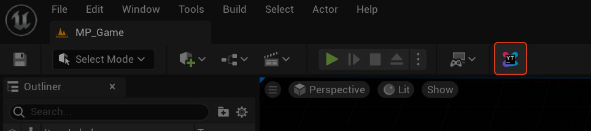
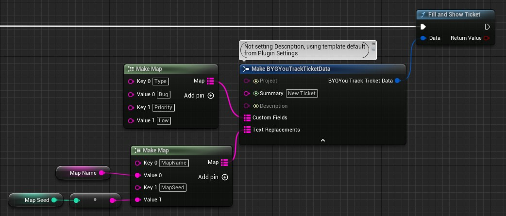

# BYG YouTrack Filler

Simplifies submitting tickets to YouTrack by:
* Pre-filling game and PC information (e.g. current map, build number, PC specs).
* Opening log and screenshot directories on the user's PC so they can drag and drop log files and screenshots.

## Features

* Works in-editor and non-shipping builds.
* Supports default ticket template and text replacements to fill out useful info.
* Supports YouTrack custom properties (e.g. Priority, Severity).
* Supports Blueprints and C++.
* Can activate from cheat console with `youtrack`.
* Does not submit tickets, only pre-fills data. So no half-filled
* Does not require or store authentication information. All operations are local to the user's computer.
* YouTrack `.ini` information automatically stripped from Shipping builds.

## Usage

### Installation

1. Clone/download the repository to somewhere inside your `Project/Plugins` folder.
2. Rebuild the project and open the editor
3. Configure the settings in **Edit > Project Settings > Plugins > BYG YouTrackFiller**
4. Set the proper `YouTrack Base Url` and `Project` values (Project needs ticket ID, e.g. RAM)
5. Update the `Description` as needed. Consider using your QA's standard template. 
6. Set any `Custom Fields` by key / value pair.
7. Optionally set up a hotkey, enable screenshots, and more.

### In-Editor

Click the button in the editor to open a pre-filled ticket.



### Blueprints

Fill and Show Ticket can be called from Blueprints.



### C++

```c++
FBYGYouTrackTicketData Data;
// Any instances of {ComputerName} in the ticket will be replaced
Data.TextReplacements.Add("ComputerName", FPlatformProcess::ComputerName());

bool bSuccess = UBYGYouTrackFillerStatics::FillAndShowTicket(Data);
```

### Cheat Console

By default the cheat console command is `youtrack`. This can be changed in the plugin settings.

## Customization

### Setting Custom Ticket Properties

Your YouTrack may have custom properties for priority, category, severity etc. It is possible to set these using the
Custom Fields property when calling Fill And Show Ticket. First you need to confirm the name of your custom properties:

1. Click "New Ticket".
2. In your new ticket, change values in the right-hand properties panel.
3. Click "Generate issue template URL".
4. Note the `c=Property` values, where `Property` is the name of your custom value field. e.g. `Assignee`.

You can now use these custom values on your default settings or when submitting reports via C++ or Blueprints.

### Templates

The plugin will automatically replace any text wrapped with curly braces `{Example}`. This is only done for the Summary and Description fields.

```c++
FBYGYouTrackTicketData Data;
Data.TextReplacements.Add("MapName", "Facing Worlds");
Data.TextReplacements.Add("GameVersion", "4.2");
Data.TextReplacements.Add("PerforceVersion", "82582");
```

In the plugin settings, we set up this default Description.
```c++
Current Map: {MapName}
Game Version: {GameVersion}
Perforce Checklist: {PerforceVersion}
```

The resulting ticket would have this in the Description:
```
Current Map: Facing Worlds
Game Version: 4.2
Perforce Checklist: 82582
```

### C++ Behavior

Customizing other behavior is supported by subclassing `UBYGYouTrackFiller` and changing the Plugin settings to use
this new class as the default.

## Compatability

Compiled with Unreal Engine versions 4.25, 4.27, and 5.0. Tested with Unreal Engine versions 4.25, and 5.0.

Tested on Windows 10, not tested on Linux or Mac. Uses `FPlatformMisc::OsExecute(TEXT("open"), *URL, TEXT(""))` to open
a browser to view YouTrack and local files.


## Useful functions for attaching info

```c++
const FString CPUBrand = FWindowsPlatformMisc::GetCPUBrand();
const FString GPUBrand = FWindowsPlatformMisc::GetPrimaryGPUBrand();

// Monitor info
FDisplayMetrics Display;
FDisplayMetrics::RebuildDisplayMetrics( Display );
```

## Future Work

* Instead of opening a bunch of directories, could instead copy all useful files to a single temp directory to make it
  easier for users to know which files are relevant. Would also make it easier for them to select all and attach to the
  ticket.
* Support other bug trackers, if they allow the same HTTP-get parameters thing.
